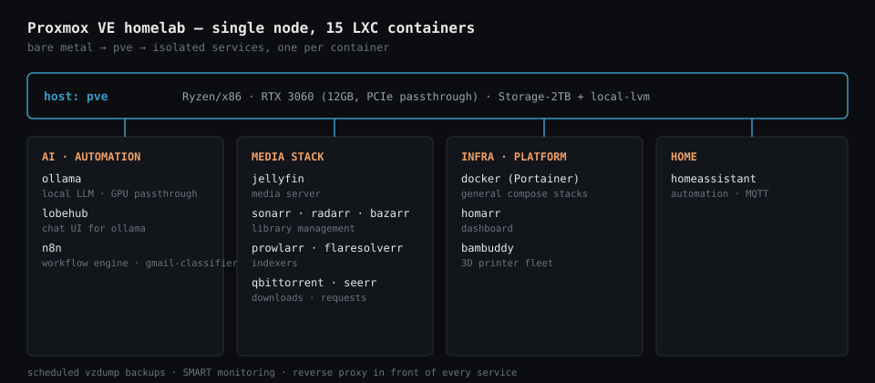

<h1 align="center">Omri Elcharizi</h1>

  

  
  
  
  

---

Three years as a systems technician and team lead in an operational Air Force environment: Windows Server, Active Directory, VMware vSphere, and endpoint security for hundreds of users under SLA, where a mistake reaches real people fast. I'm moving that discipline into DevOps: a Proxmox homelab run the same way production should be, Infrastructure-as-Code, and an AWS Solutions Architect certification in progress.

I maintain the servers and I write the interfaces that talk to them, so I debug the whole stack, not just my half of it.

## Experience

**Frontend & Infrastructure &#183; Reserves**, Maintenance Squadron, Israeli Air Force &#183; Today to Apr 2026
Client-side development alongside the technical role: rebuilding screens for a daily-use system, adding validation scripts, turning end-user feedback into interface changes.

**Systems Technician &#183; Team Lead**, Maintenance Squadron, Israeli Air Force &#183; Aug 2023 to Apr 2026
Led a team of technicians in a multi-site operational environment. Active Directory account and permission management, Windows Server 2012/2016 and Linux maintenance over SSH, VMware vSphere and IBM enterprise storage support, endpoint security with McAfee ePO (Trellix), support for hundreds of users under SLA.

## Certifications & education

- AWS Certified Solutions Architect, Associate: in progress
- DevOps Digital, Ecomschool: in progress (final certificate pending two exams)
- Diploma, Electronics & Computer Engineering, HaMechina HaTechnologit Mekif Alef, Ashdod (2023)

## Stack

**Systems & networking**

  
  
  
  

**Infrastructure as code**

  
  
  
  
  

**Automation & observability**

  
  
  
  

## Projects

**[homelab-as-code](https://github.com/OmriTGM/homelab-as-code)** &#183; 
Terraform provisions 15 LXC containers from one data map, Ansible configures them, and an exporter I wrote publishes state to Prometheus. The `containers` map that creates a container is the same one that labels its metrics, so the lab and its monitoring can't drift apart. 23 tests, five documented ADRs, gitleaks in CI, and a known-limitations section that says what's actually still rough.

**[mail-classifier](https://github.com/OmriTGM/mail-classifier)**
n8n polls Gmail every 15 minutes, sends each new email to a local LLM (qwen3:14b) on an RTX 3060, and applies a matching label. The classify request retries twice with a 5-second gap and continues on failure, so one bad response doesn't stall the queue. Zero API cost since the model runs at home.

## Home lab

  

Single node, 15 isolated LXC containers, one RTX 3060 passed through for local inference. Scheduled backups, SMART monitoring, a reverse proxy in front of every service. Full write-up and incident postmortems (driver mismatches, mount misconfigurations, the usual) at [omrielcharizi.com](https://omrielcharizi.com).

## Looking for

DevOps, System Administration, NOC, or IT infrastructure: a team where I can build, break things in a controlled environment, and fix them down to the root cause.
